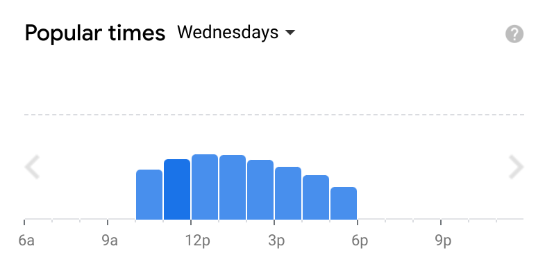

# Crowd Factor

> Surf crowd predictions

## What is this

As a surfer you are constantly trying to assess the best time to surf. This not only involves looking at the forecast and conditions but also gauging when it's going to be most crowded - sometimes you'll get more waves if you surf when the conditions are a little worse but the spot is less crowded, a little game theory. In order to make the best decision on when to surf you need forecast data on both the waves conditions and the crowd. The former is easy to get from [surfline](https://www.surfline.com/) but there is no data on surf crowds, YET! Crowdfactor provides an interface similar to google maps "popular times", giving a more quantitative approach on deciding when to surf.



## How it works

Every 10 mins, Crowdfactor will stream a minute of footage from the configured [surfline camera](https://www.surfline.com/surf-report/venice-breakwater/590927576a2e4300134fbed8). It then feeds that footage into a computer vision model to count the number of surfers in the water. The surfer count is then saved to a database along with the [surf rating](https://www.surfline.com/surf-news/surflines-rating-surf-heights-quality/1417) at the time of recording.


With this database you can then make predictions based on the day of the week, time and surf rating. For instance if it's a Wednesday 11am and the conditions are poor, you can take an average of the previous crowd recordings on Wednesday at 11am when conditions have been poor to make a prediction. These predictions are visualised along side the real recordings for the day on a [dashboard](https://9d6cb911e0cb153469c25e3e910ac831.balena-devices.com/).


## Usage:

```
poetry install
```

```
poetry shell
```

### Running the worker:

```
SURFLINE_SPOT_ID=590927576a2e4300134fbed8 ROBOFLOW_API_KEY=<secret> FLASK_DEBUG=1 FLASK_APP=lib/app python worker.py
```

### Running the server:

```
SURFLINE_SPOT_ID=590927576a2e4300134fbed8 ROBOFLOW_API_KEY=<secret> FLASK_DEBUG=1 FLASK_APP=lib/app flask run 
```
