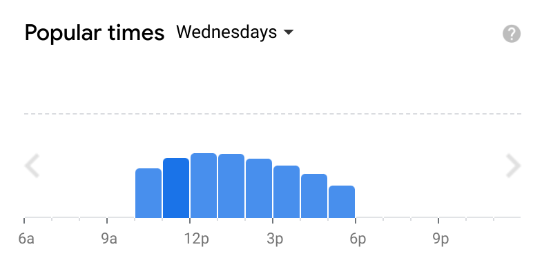
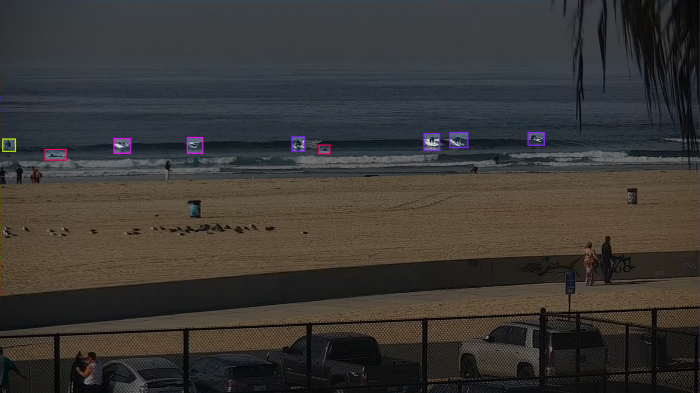
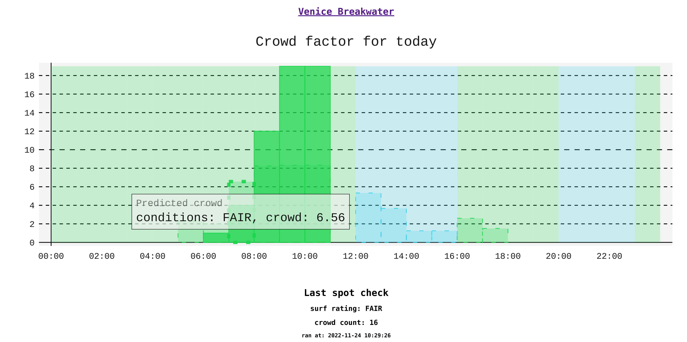

# Crowd Factor

> Surf crowd predictions

As a [surfer](https://en.m.wikipedia.org/wiki/Surfing) you are constantly trying to assess the best time to surf. This not only involves looking at the forecast and conditions but also gauging when it's going to be most crowded. Sometimes you'll get more waves if you surf when the conditions are a little worse but the spot is less crowded - an exercise in game theory. 

In order to make the best decision on when to surf you need forecast data on both the waves conditions and the crowd. The former is easy to get from [surfline](https://www.surfline.com/) but there is no data on surf crowds... YET!

The idea is that Crowdfactor provides an interface similar to google maps *["popular times"](https://blog.google/products/maps/maps101-popular-times-and-live-busyness-information/)*, giving a more quantitative approach on deciding when to surf.



## How it works

Every 10 mins, Crowdfactor will stream a minute of footage from a configured [surfline camera](https://www.surfline.com/surf-report/venice-breakwater/590927576a2e4300134fbed8). It then feeds that footage into a computer vision model to count the number of surfers in the water. The surfer count is then saved to a database along with the [surf rating](https://www.surfline.com/surf-news/surflines-rating-surf-heights-quality/1417) at the time of recording.



With this database you can then make predictions based on the day of the week, time, weather and surf rating. Everyday a model is trained against the existing recordings, which allows you to make increasingly accurate predictions about the future crowd count.

These predictions are visualised along side the real recordings and the forecasted [surf ratings](https://support.surfline.com/hc/en-us/articles/5402742348955-Surf-Conditions-Ratings-and-Colors) for the day on a [dashboard](https://9d6cb911e0cb153469c25e3e910ac831.balena-devices.com/).



## Usage:

First find your spot on [surfline](https://www.surfline.com), copy the spot_id from the URL. Then create a [roboflow account](https://roboflow.com/) and get an API key. 

Then run it the project with docker-compose:

```
SURFLINE_SPOT_ID=<spot_id> ROBOFLOW_API_KEY=<roboflow_key> docker-compose up -d
```

You can view the dashboard at `http://localhost`.

## Development

```
poetry install
```

```
poetry shell
```

### Running the worker:

```
SURFLINE_SPOT_ID=590927576a2e4300134fbed8 ROBOFLOW_API_KEY=<secret> FLASK_DEBUG=1 FLASK_APP=lib/app python worker.py
```

### Running the server:

```
SURFLINE_SPOT_ID=590927576a2e4300134fbed8 ROBOFLOW_API_KEY=<secret> FLASK_DEBUG=1 FLASK_APP=lib/app flask run
```
